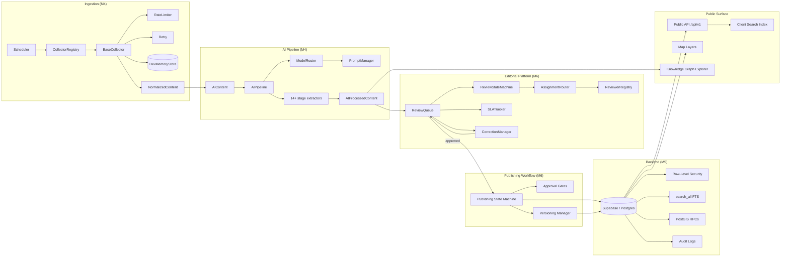
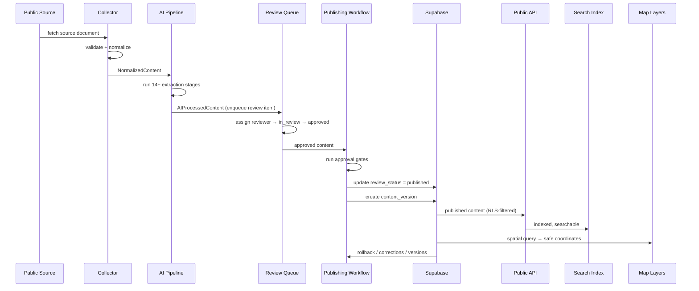
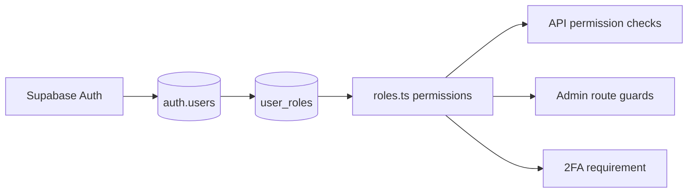
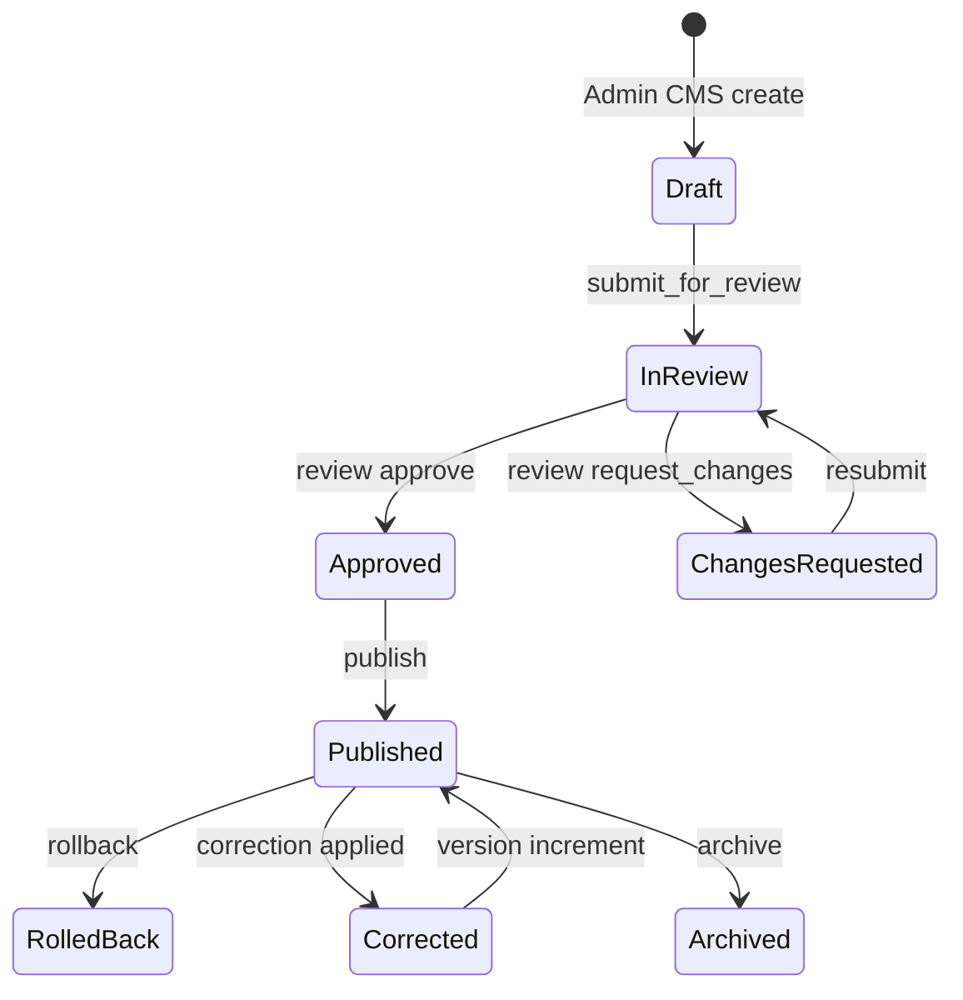

# System Integration Diagram

> Milestone 7 — Functional Beta. End-to-end integration of the collector
> framework (M4), Supabase backend (M5), and editorial platform (M6).

This document describes how every subsystem connects, the data flow through
the pipeline, and the integration points between systems. It complements the
architecture overview in [`architecture.md`](./architecture.md) and the
database model in [`data-model.md`](./data-model.md).

## 1. Component map

## 2. End-to-end data flow

The primary data path runs from a public source through AI processing,
editorial review, publication, and out to every public surface.

## 3. Integration points

| From | To | Interface | Contract |
|---|---|---|---|
| Collector | AI Pipeline | `NormalizedContent` → `AIContent.source` | `title`, `body`, `url`, `tags`, `metadata` |
| AI Pipeline | Review Queue | `AIProcessedContent` → review item `aiOutput` | `pipelineRunId`, `stageResults` |
| Review Queue | Publishing | `approved` review state → `publish` action | Valid `ReviewState` → `PublishState` transition |
| Publishing | Backend | `executeTransition()` → `evidence_items.review_status` | `PublishState` persisted; RLS filters public reads |
| Publishing | Versioning | `content_versions` insert | Version number derived from previous version |
| Backend | Public API | `GET /api/v1/evidence/:slug` | Published + public visibility only |
| Backend | Search | `search_all()` FTS / client `search()` | Published records indexed as `SearchableRecord` |
| Backend | Map | PostGIS RPCs (`evidence_nearby`, `evidence_in_bbox`) | Results pass through `safeCoordinate()` |
| AI Pipeline | Knowledge Graph | `populateFromPipeline()` | Graph nodes/edges validated against schema |

## 4. Identity & role propagation

Users created in Supabase Auth are assigned a role in `user_roles`. The
`roles.ts` module resolves that role into a permission set
(`content:read`, `content:publish`, `review:approve`, …) which gates API
access, admin routes (`AuthGuard`), and content operations. All non-public
roles require 2FA.

## 5. Content lifecycle

## 6. Verification

Every stage boundary is verified by:

- `npm run typecheck` — TypeScript interfaces align across pipeline boundaries
- `scripts/verify-data-flow.ts` — runtime shape assertions per stage
- `src/__tests__/integration/fullSystem.test.ts` — the complete pipeline with
  all external services mocked

Run the full check with `scripts/verify-data-flow.sh` (CI-compatible).
